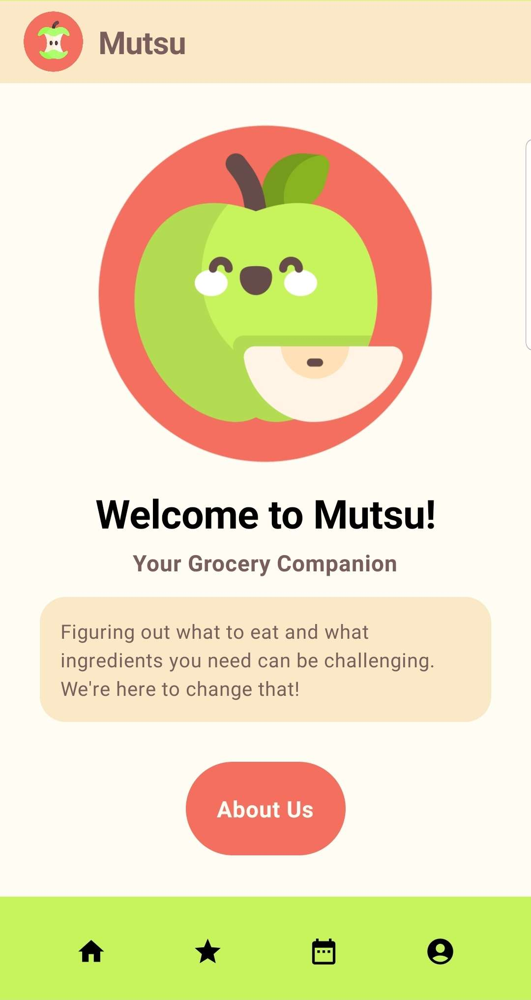
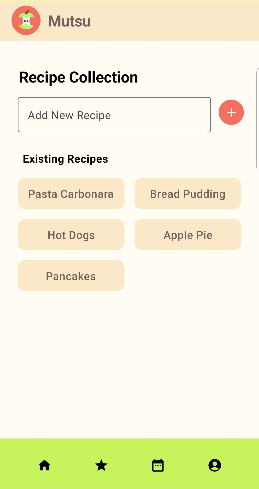
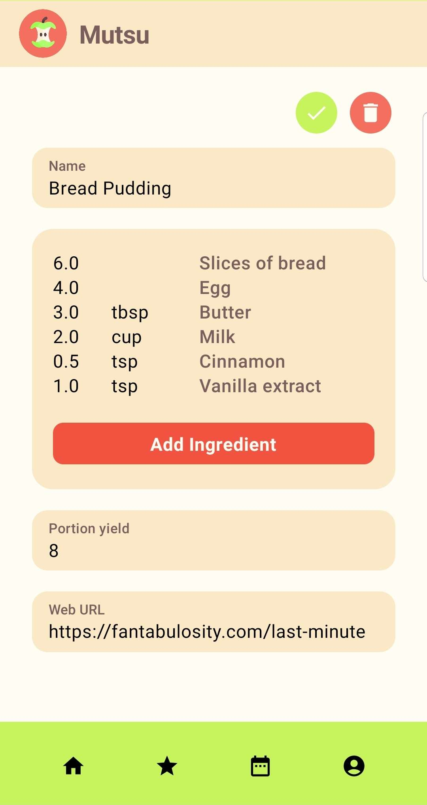
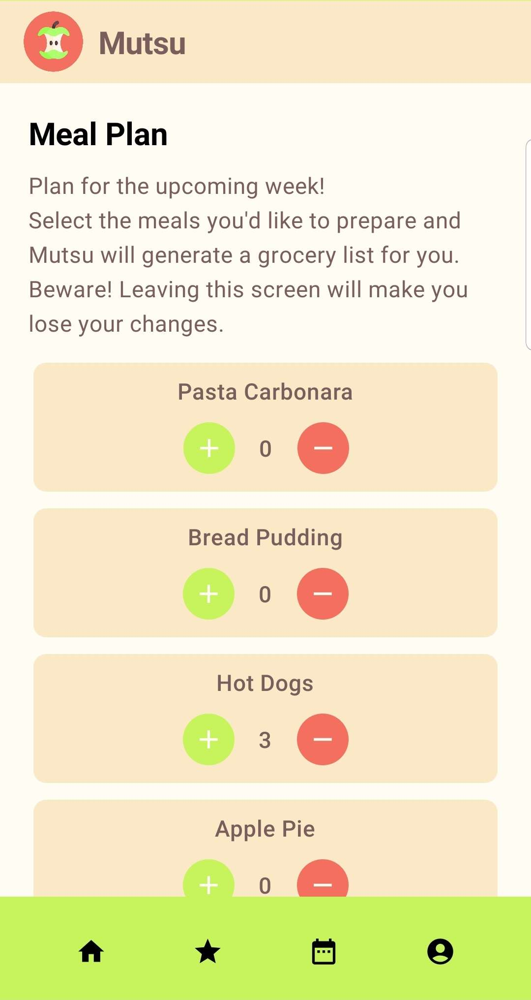
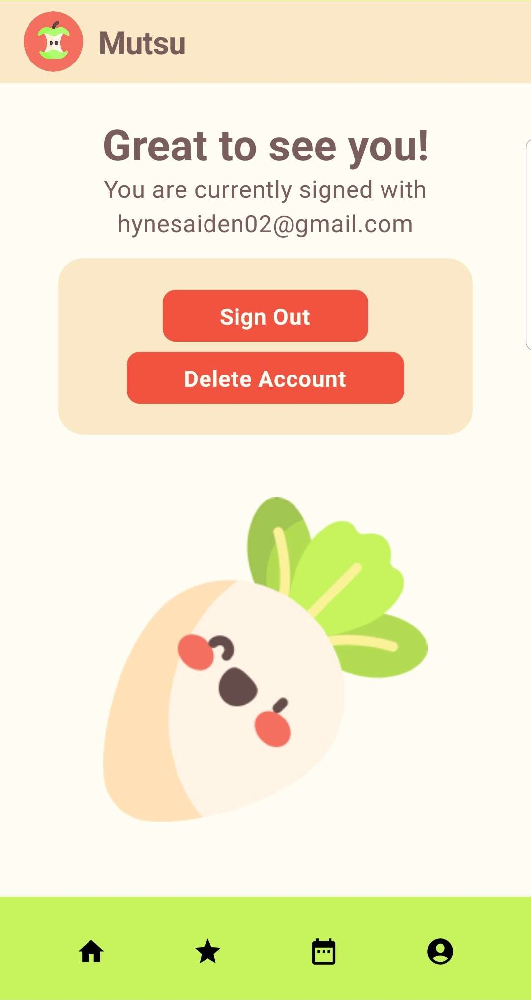

# 🍏 Mutsu - Your Grocery Companion! 

## 🛒 Goal
Mutsu is an Android application designed to simplify your grocery shopping experience. With Mutsu, you can effortlessly create the perfect grocery list tailored to your unique needs and preferences.

## 📝 Key Features
- **Recipe Collection:** Mutsu allows you to input your favorite go-to recipes and the ingredients required for each of them. You can easily build a library of your go-to meals.
- **Meal Planning:** When it's time to plan your upcoming week's meals, Mutsu makes it a breeze. Simply select the recipes you want to prepare and specify the number of meals you'd like to cook.
- **Grocery List:** Mutsu then goes to work, instantly generating a comprehensive grocery list based on your selected recipes and portion preferences. Say goodbye to the hassle of manually compiling a list of ingredients!
- **Adjust:** Refine the generated list with ease by effortlessly adding or removing ingredients based on your pantry stock, ensuring it aligns with your needs!

## 🏃 Getting Started

### Install Application
- To the right of the list of files on our main github repository page, click on "Releases"
- Select the most recent release
- Download the .apk file
- Run the file on either an Android device or an emulator
- Enjoy! 

### Launch Application
Download the code from this repository by either cloning the repo or just downloading it as a .zip. This can be done using by pressing the green 'Code' button on the right side of the screen. It will give you multiple options of how to download or clone this code. Keep track of where you are saving the files.

To launch this app, open the project you've cloned or downloaded in Android Studio. Once the project has loaded, there should be a button in the top right to run the app. Click this button and a phone emulator will start up and run the app.

### Useful Commands
On Android Studio (or any other IDE) open a terminal by selecting `View > Tool Windows > Terminal`
- build the code with `./gradlew build`
- test the style with `./gradlew spotlessCheck`
- test the code with `./gradlew spotlessApply`

## 👀 Sneakpeek

## ⚖️ License
This project is licensed under the GNU License - see the LICENSE.md file for details

## 🐱‍💻 Authors
Diana Karpeev - dianakarpeeva@gmail.com  
Mel Hynes - hynesaiden02@gmail.com  
Breanna de Forest - bdeforest01@gmail.com  
